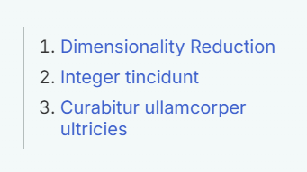
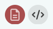

# Personal Site

## Local Development

Make sure you have [Node.js](https://nodejs.org/) installed. Install all
dependencies using npm:

```
npm install
```

To start the local development server, execute:

```
npm start
```

## Pages

For each page there is a directory in the `/src` directory, together with an
`index.html` file within. Nested pages can be represented by nested directories.

To create a new page, create a corresponding folder and use `template.html` to
create an `index.html` within. All links and references are absolute, so there's
no need to adjust them. Adjust the title within the `<title>` tag and place your
content in `<!-- Content goes here -->`.

## Design Configuration

Colors and fonts can be configured in `/src/assets/styles/config.css`.

## Automatic Side Navigation Generation

Pages can automatically generate a side navigation based on the level two
headers `<h2>` available on the page.



To include a level two header in the side navigation, give them a unique id:

```html
<h2 id="dimensionality-reduction">Dimensionality Reduction</h2>
```

## Custom Components Usage

There are some common custom components that can be used within any page.

### Button Links



```html
<ul class="button-links">
  <li class="highlight">
    <a href="#" title="Download PDF">
      
    </a>
  </li>
  <li>
    <a href="#" title="View Code">
      
    </a>
  </li>
</ul>
```

Icons are from [Font Awesome](https://fontawesome.com), downloaded as SVG, and
put in `/src/assets/img/icons`. You can
[download more free icons here](https://fontawesome.com/search?o=r&m=free).

### Publication List


```html
<ul class="publication-list">
  <li>
    <span class="title">
      Visualizing single-cell data with the neighbor embedding spectrum
    </span>
    <span class="authors">
      S Damrich, MV Klockow, P Berens, FA Hamprecht, D Kobak
    </span>
    <span class="periodical">Preprint, 2024</span>

    <ul class="button-links">
      <li class="highlight">
        <a href="#" title="Download PDF">
          
        </a>
      </li>
      <li>
        <a href="#" title="View Code">
          
        </a>
      </li>
    </ul>
  </li>
  <li>
    <span class="title">
      <a href="#">
        Persistent homology for high-dimensional data based on spectral methods
      </a>
    </span>
    <span class="authors">S Damrich, P Berens, D Kobak</span>
    <span class="periodical"> arXiv preprint arXiv:2311.03087, 2023 </span>

    <ul class="button-links">
      <li class="highlight">
        <a href="#" title="Download PDF">
          
        </a>
      </li>
      <li>
        <a href="#" title="View Code">
          
        </a>
      </li>
    </ul>
  </li>
</ul>
```

### Teaching List
